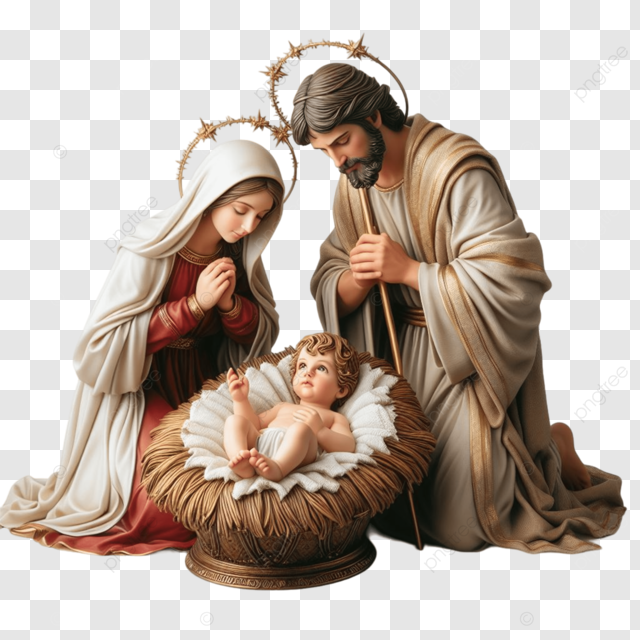

# Carrossel de Natal

Um projeto simples para você aprender a criar seu próprio carrossel de imagens com JavaScript! Este carrossel é inspirado no tema de Natal e permite a navegação entre slides com botões de "Voltar" e "Próximo", além de indicadores de slide.

## O que você vai precisar?

- Conhecimentos básicos de HTML
- Conhecimentos em CSS e código de cores
- Conhecimentos básicos em JavaScript
- Versionamento de código no Git
- IDE de sua preferência (recomendo o Visual Studio Code)

## Estrutura do Projeto

1. **Criação das pastas e arquivos**
   - Crie uma pasta para o projeto e dentro dela:
     - `index.html` — arquivo HTML com a estrutura da página.
     - `assets/` — pasta para armazenar as imagens do carrossel.
     - `styles.css` — arquivo para estilização.
     - `handle.js` — arquivo com o código JavaScript.

## Passo 1: Criar a estrutura HTML

No arquivo `index.html`, coloque o seguinte código:

```html
<!DOCTYPE html>
<html lang="pt-br">
<head>
  <meta charset="UTF-8">
  <meta name="viewport" content="width=device-width, initial-scale=1.0">
  <link rel="stylesheet" href="styles.css" />
  <title>Carrossel Especial de Natal</title>
</head>
<body>
  <div class="container">
    <a class="prev" href="#" onclick="addSlides(-1)">
      <span>&#10094;</span>
      <span class="prev-text">Voltar</span>
    </a>
    <div>
      <div class="slides fade">
        
        <h2 class="title">ALEGRIA E FELICIDADE</h2>
        <p class="content">Que o espírito do Natal traga muita alegria, paz e amor para o seu coração...</p>
      </div>
      <div class="slides fade">
        
        <h2 class="title">AMOR E BONDADE</h2>
        <p class="content">Que possamos espalhar carinho, compreensão e esperança por onde passarmos...</p>
      </div>
      <div class="slides fade">
        
        <h2 class="title">FELIZ NATAL</h2>
        <p class="content">Desejo a você um Natal repleto de amor, alegria e momentos especiais...</p>
      </div>
    </div>
    <div class="footer">
      <button class="button" onclick="addSlides(1)">Próximo</button>
      <div class="dot-box">
        <span class="dot" onclick="currentSlide(1)"></span>
        <span class="dot" onclick="currentSlide(2)"></span>
        <span class="dot" onclick="currentSlide(3)"></span>
      </div>
    </div>
  </div>
  <script src="handle.js"></script>
</body>
</html>
```

## Passo 2: Estilização com CSS

No arquivo `styles.css`, coloque o seguinte código:

```css
* {
  box-sizing: border-box;
  margin: 0;
  padding: 0;
}

body {
  width: 100%;
  height: 100vh;
  display: flex;
  justify-content: center;
  align-items: center;
  font-family: Tahoma, sans-serif;
  background-image: linear-gradient(to bottom left, #b81414, #228b22);
}

.slides {
  gap: 8px;
  flex-direction: column;
  justify-content: center;
  align-items: center;
}

.container {
  display: flex;
  flex-direction: column;
  justify-content: space-between;
  align-items: center;
  background-color: #fff;
  width: 400px;
  height: 600px;
  padding: 32px;
  border-radius: 32px;
}

.prev {
  display: flex;
  align-items: center;
  gap: 8px;
  width:  100%;
  color: #D41D1D;
  text-decoration: none;
}

.prev-text {
  margin-top: 4px;
}

.title {
  font-size: 28px;
  width: 100%;
  font-weight: bold;
  text-align: center;
}

.content {
  width: 200px;
  text-align: center;
}

img {
  width: auto;
  height: 160px;
}

.footer {
  display: flex;
  flex-direction: column;
  gap: 28px;
}

.button {
  background-color: #0000FF;
  color: #fff;
  width: 200px;
  height: 40px;
  font-size: 16px;
  border: none;
  cursor: pointer;
  border-radius: 999px;
}

.dot-box {
  text-align: center;
}

.dot {
  display: inline-block;
  width: 15px;
  height: 15px;
  margin: 0 2px;
  background-color: #c1c1c1;
  border-radius: 50%;
  cursor: pointer;
  transition: background-color .6s ease;
}

.active, .dot:hover {
  background-color: #D41D1D;
}

.fade {
  animation-name: fade;
  animation-duration: 1.5s;
}

@keyframes fade {
  from { opacity: .2 }
  to { opacity: 1 }
}
```

## Passo 3: Funcionalidade JavaScript

No arquivo `handle.js`, adicione o seguinte código:

```javascript
let index = 1;
showSlides(index);

function addSlides(n) {
  showSlides(index += n)
}

function currentSlide(n) {
  showSlides(index = n)
}

function showSlides(n) {
  let slides = document.getElementsByClassName("slides");
  let dots = document.getElementsByClassName("dot");

  if (n > slides.length) {
    index = 1;
  }

  if (n < 1) {
    index = slides.length;
  }

  for (let i = 0; i < slides.length; i++) {
    slides[i].style.display = 'none';
    dots[i].className = dots[i].className.replace(" active", "");
  }

  slides[index-1].style.display = "flex";
  dots[index-1].className += " active";
}
```

## Como Funciona

### HTML:
- A estrutura contém três slides com imagens e textos.
- Botões de navegação "Voltar" e "Próximo", além de pontos indicadores de slide, para facilitar a interação.

### CSS:
- O carrossel é estilizado para ser responsivo, com animações suaves e um design visualmente atraente.
- A navegação é organizada com flexbox, e as imagens e textos são centralizados.

### JavaScript:
- O código JavaScript controla a navegação entre os slides. A função `showSlides()` altera o índice do slide visível.
- `addSlides()` permite navegar entre os slides clicando nos botões "Próximo" ou "Voltar".
- `currentSlide()` permite navegar diretamente para um slide clicando no ponto indicador.

## Como Rodar

1. Clone este repositório.
2. Abra o arquivo `index.html` em um navegador.
3. Navegue pelos slides utilizando os botões ou clicando nos pontos.

## Contribuições

Se você tiver sugestões ou melhorias, sinta-se à vontade para abrir um *pull request*!
## Resultado


## Licença

Este projeto está licenciado sob a [MIT License](LICENSE).
